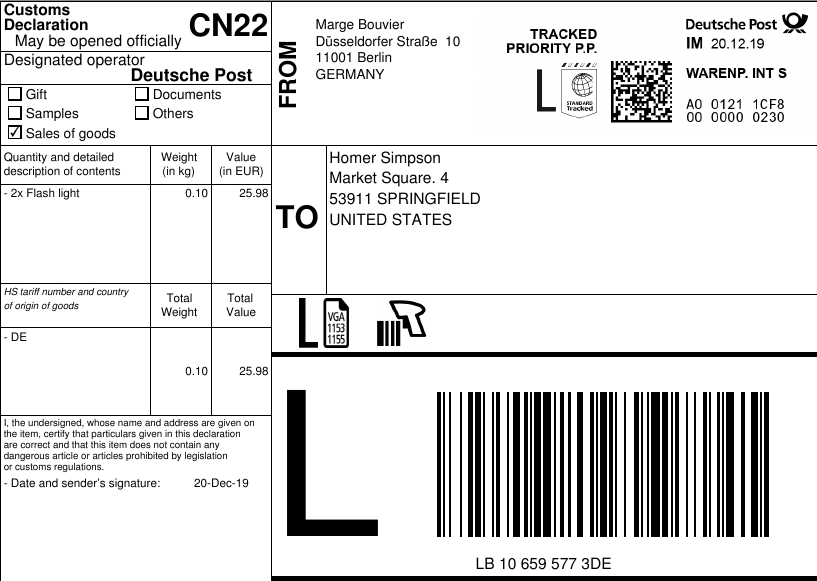

# python_deutschepost
This wrapper makes it possible to create shipping labels "Warenpost International" of this form:

## DeutschePost API Structure

DeutschePost has (at least) 2 APIs:

1. Internetmarke SOAP API. There is a very good python wrapper for it http://git.sysmocom.de/python-inema/
2. Deutsche Post REST https://api-qa.deutschepost.com/dpi-apidoc/ . There seems to be no python wrapper for it (yet). 
   * The Internetmarke products are also available through this API, however the REST API is only a wrapper for the underlying SOAP API. 
   * **Some Internetmarke products are "extended" through this API**. For example is the "Warenpost International" (with a customs form) only available with this API.  The Internetmarke API  only offers  "Warenpost International" (**without** a customs form), and it is not clear if this is valid.
   * This module offers these "extended" Internetmarke products available in python.

### Available Products

The following products are available through this extended Internetmarke API:

| Code  | Product                    | Region  | Region    | Signature    | Price (cents) | 
|-------|----------------------------|---------|-----------|--------------|---------------| 
| 10246 | Warenpost International XS | Non-EU  | Untracked |              | 320           | 
| 10247 | Warenpost International S  |  Non-EU | Untracked |              | 370           | 
| 10248 | Warenpost International M  |  Non-EU | Untracked |              | 700           | 
| 10249 | Warenpost International L  |  Non-EU | Untracked |              | 1700          | 
| 10250 | Warenpost International XS | Non-EU  | Tracked   |              | 545           | 
| 10251 | Warenpost International S  |  Non-EU | Tracked   |              | 595           | 
| 10252 | Warenpost International M  |  Non-EU | Tracked   |              | 925           | 
| 10253 | Warenpost International L  |  Non-EU | Tracked   |              | 1925          | 
| 10254 | Warenpost International XS | EU      | Untracked |              | 381           | 
| 10255 | Warenpost International S  |  EU     | Untracked |              | 440           | 
| 10256 | Warenpost International M  |  EU     | Untracked |              | 833           | 
| 10257 | Warenpost International L  |  EU     | Untracked |              | 2023          | 
| 10258 | Warenpost International XS | EU      | Tracked   |              | 649           | 
| 10259 | Warenpost International S  |  EU     | Tracked   |              | 708           | 
| 10260 | Warenpost International M  |  EU     | Tracked   |              | 1101          | 
| 10261 | Warenpost International L  |  EU     | Tracked   |              | 2291          | 
| 10272 | Warenpost International KT | Non-EU  | Untracked |              | 100           | 
| 10273 | Warenpost International KT | Non-EU  | Tracked   |              | 325           | 
| 10270 | Warenpost International KT | EU      | Untracked |              | 100           | 
| 10271 | Warenpost International KT | EU      | Tracked   |              | 325           | 
| 10280 | Warenpost International XS | Non-EU  |           | Unterschrift | 570           | 
| 10281 | Warenpost International S  |  Non-EU |           | Unterschrift | 620           | 
| 10282 | Warenpost International M  |  Non-EU |           | Unterschrift | 950           | 
| 10283 | Warenpost International L  |  Non-EU |           | Unterschrift | 1950          | 
| 10284 | Warenpost International XS | EU      |           | Unterschrift | 678           | 
| 10285 | Warenpost International S  |  EU     |           | Unterschrift | 738           | 
| 10286 | Warenpost International M  |  EU     |           | Unterschrift | 1131          | 
| 10287 | Warenpost International L  |  EU     |           | Unterschrift | 2321          | 
| 10292 | Warenpost International KT | EU      |           | Unterschrift | 350           | 
| 10293 | Warenpost International KT | Non-EU  |           | Unterschrift | 350           | 

## Registration
For both APIs registration is only possible through email addresses: api@deutschepost.de  and pcf-1click@deutschepost.de

## Problems

Because the Internetmarke SOAP API is wrapped by a REST API, some responses are soap responses (xml), and some are rest responses (json).

Only a few of the api calls from https://api-qa.deutschepost.com/dpi-apidoc  are forwarded to the Internetmarke API.

This creates the weird situation that even though 1 api is used, the fractured underlying apis and systems are painfully obvious. 

